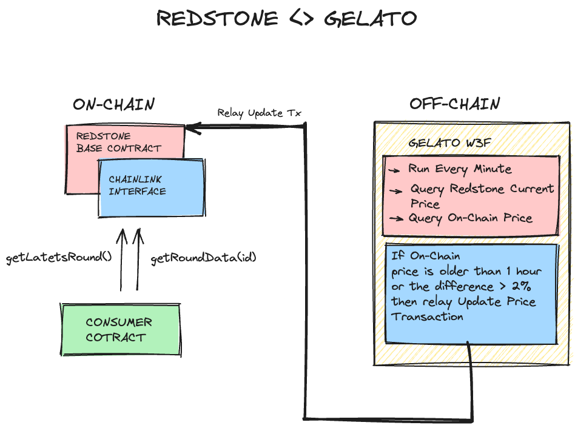

# Gelato Web3 functions <<-->> RedStone 

## Summary

Oracle that using RedStone and Gelato Web3 functions to:
Push on-chain price if the price difference between stored and live price is gerater than 2% or the time elpased since last update is greater than one hour
 
### How it works
  

## Demo
- Lisk Sepolia:
  - ETH Price Feed Smart Contract: [https://sepolia-blockscout.lisk.com/address/0x6F9A3AC224025B0A9E7b7F47dcb1DF7872e2fA75](https://sepolia-blockscout.lisk.com/address/0x6F9A3AC224025B0A9E7b7F47dcb1DF7872e2fA75)
  - Web3 Function ETH UPDATE: [https://app.gelato.network/functions/task/0x98ab97a550430b0f92bb9d0c89582af773882c1fb60c3cfc043ad780de2cdc9b:4202](https://app.gelato.network/functions/task/0x98ab97a550430b0f92bb9d0c89582af773882c1fb60c3cfc043ad780de2cdc9b:4202)

  - USDC Price Feed Smart Contract: [https://sepolia-blockscout.lisk.com/address/0xC603180D79a5Afa341A59134d126fC72Bcd19283](https://sepolia-blockscout.lisk.com/address/0xC603180D79a5Afa341A59134d126fC72Bcd19283)
  - Web3 Function USDC UPDATE: [https://app.gelato.network/functions/task/0x67f917f8c1430b0122d60d9b56a50ad0f18394a7ffa9e9467ee7881995ed7d31:4202](https://app.gelato.network/functions/task/0x67f917f8c1430b0122d60d9b56a50ad0f18394a7ffa9e9467ee7881995ed7d31:4202)


## How to run the W3F

1. Install project dependencies:
```
yarn install
```

2. Create a `.env` file with your private config at the root folder:
```
cp .env.example .env
```
You will need to input your `PROVIDER_URLS`, your RPC.

At the W3F folder also:
```
cp .env.example .env
```
You will need to input your `GELATO_API_KEY`for Relay, please visit [htts://app.gelato.netwoek](https://app.gelato.network/)

3. Test the  web3 function
```
npx w3f test web3-functions/redstone-relay/index.ts --logs --chain-id=4202
```

4. Deploy the web3 function on IPFS
```
npx w3f deploy web3-functions/redstone-relay/index.ts
```
 ✓ Web3Function deployed to ipfs.
 ✓ CID: QmQYPZ6VGanbg1PoMmswYGTsQz3CXeBLvbXoXAfcFkFUYz

5. Create the task following the link provided when deploying the web3 to IPFS in our case:
```
> https://beta.app.gelato.network/new-task?cid=QmQYPZ6VGanbg1PoMmswYGTsQz3CXeBLvbXoXAfcFkFUYz
```
